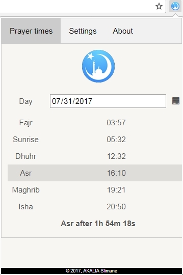
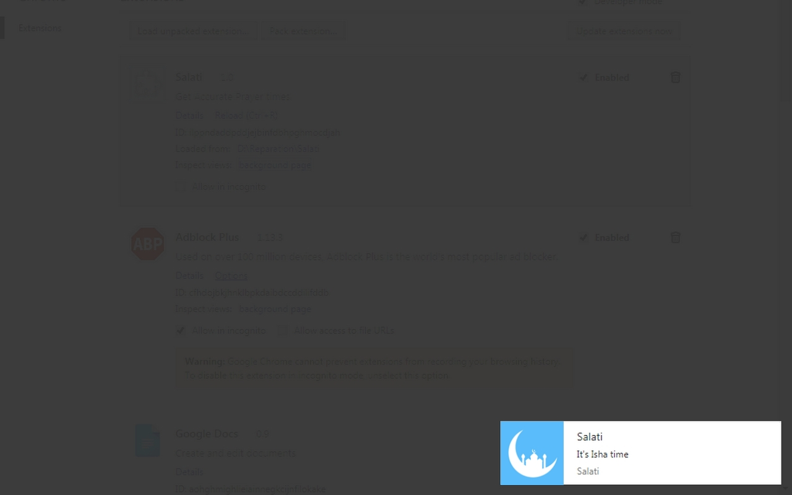
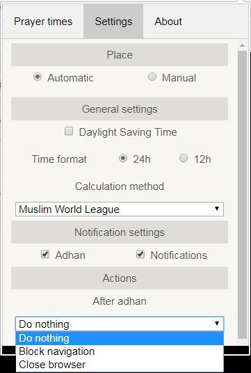

# Salati

  

## Overview
**Salati** is a google chrome extension that shows the prayer times for muslims.

  

In a prayer time salati push a text notification, plays adhan and execute some actions (block internet or close browser).

  

    
    
  

All this can be configured by the user using a simple user interface.

  

The extension uses HTML 5 features and chrome JavaScript API.

## Prayer Times Calculation

Muslims perform five prayers a day. Each prayer is given a certain prescribed time during which it must be performed.
The prayer calculations are based off [PrayTimes library](http://praytimes.org/) by [Dr. Hamid Zarrabi-Zadeh](http://zarrabi.info/).

## Authors
* [Slimane Akalia](https://linkedin.com/in/slimaneakalia/)
* [Hamza Faraji](https://twitter.com/faraji07)
